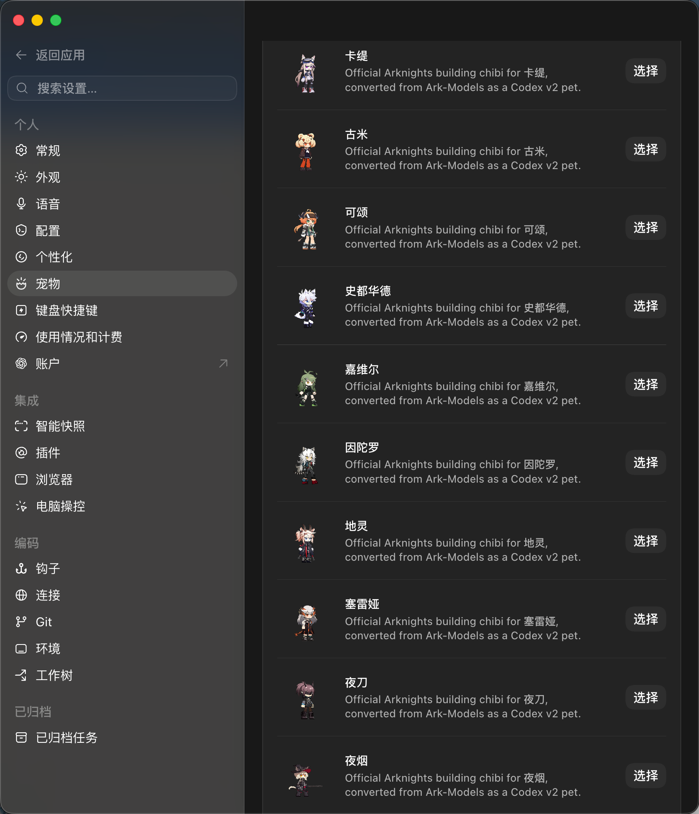
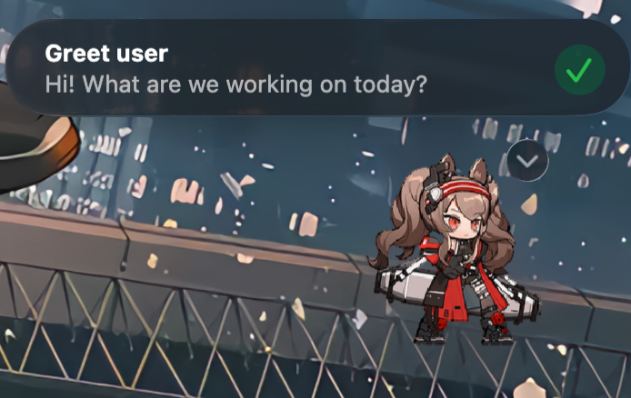
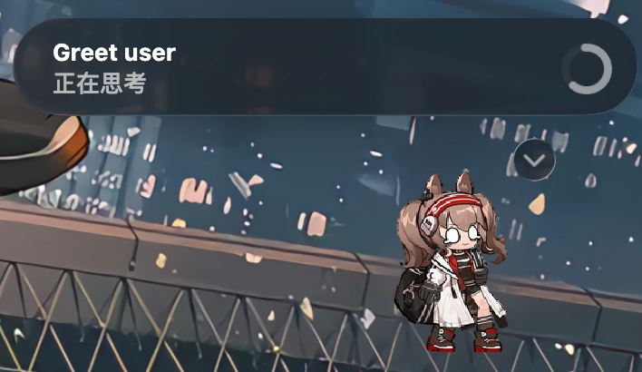
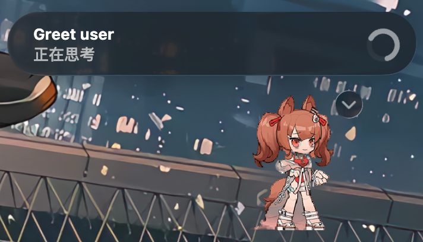

# Codex Arknights Pets / Codex 明日方舟宠物

[中文](#中文) · [English](#english)

## 效果展示 / Showcase

以下截图展示宠物安装后的选择界面，以及安洁莉娜默认服装与两套皮肤在 Codex 任务中的实际效果。静态图片只截取了动画的一帧；宠物会根据任务状态播放对应动作。

The screenshots below show the installed pet picker and Angelina's default outfit plus two outfits inside real Codex tasks. Each still captures only one animation frame; the pet plays the appropriate action as the task state changes.

<p align="center">
  
</p>
<p align="center"><sub>已安装的干员宠物 / Installed operator pets</sub></p>

<table>
  <tr>
    <td width="33%"></td>
    <td width="33%"></td>
    <td width="33%"></td>
  </tr>
  <tr>
    <td align="center">斗争血脉/I<br>Bloodline of Combat/I</td>
    <td align="center">默认服装<br>Default outfit</td>
    <td align="center">珊瑚海岸/V<br>Coral Coast/V</td>
  </tr>
</table>

## 中文

将《明日方舟》干员基建动态小人转换为 Codex v2 宠物的社区项目。本仓库只收录通过验证的成品包；完整上游素材和转换过程中的中间文件不会提交到这里。

### 制作进度

查看 [PROGRESS.md](PROGRESS.md) 了解已经完成的默认干员与皮肤，以及尚未发布的 TODO。项目会按照国服实装顺序逐步扩充；勾选状态由成品登记表自动生成。

### 安装与使用

以下命令适用于 macOS 和 Linux。

先克隆仓库：

```bash
git clone https://github.com/lockon-n/Arknights-Codex-Pets.git
cd Arknights-Codex-Pets
```

安装单个宠物（以安洁莉娜为例）：

```bash
mkdir -p "$HOME/.codex/pets/angelina"
cp pets/angelina/pet.json pets/angelina/spritesheet.* "$HOME/.codex/pets/angelina/"
```

把 `angelina` 替换为 [registry/pets.json](registry/pets.json) 中的宠物 ID 即可安装其他干员或皮肤。

批量安装仓库中的全部宠物：

```bash
for pet_dir in pets/*; do
  pet_id="$(basename "$pet_dir")"
  mkdir -p "$HOME/.codex/pets/$pet_id"
  cp "$pet_dir/pet.json" "$pet_dir"/spritesheet.* "$HOME/.codex/pets/$pet_id/"
done
```

批量安装会覆盖本地同 ID 宠物的 `pet.json` 和图集，但不会删除其他本地宠物。如果你修改过同 ID 的宠物，请先备份。

安装完成后，在 Codex 的宠物选择器中选择对应宠物。如果 Codex 已经打开但没有显示最新资源，请重启 Codex；如果只是图集缓存未刷新，也可以先切换到另一个宠物，再切换回来。

### 仓库结构与成品规范

每个通过验收的宠物目录包含：

```text
pets/<pet-id>/
  pet.json
  spritesheet.webp|png
  SOURCE.md
  provenance.json
  qa/
    validation.json
    preview.png
    v2-validation.json
    directions-labeled.png
    direction-continuity.json
    contact-extended.png
    standard-contact.png
```

Codex 本地使用时只需要 `pet.json` 和 `spritesheet.webp` 或 `spritesheet.png`；其余文件用于来源追踪和质量验证。

`pet.json` 必须使用 `spriteVersionNumber: 2`，图集必须是通过验证的 1536×2288、8×11 精灵表。原始 Spine 文件、Atlas PNG、渲染缓存和未通过验收的中间文件均保留在本仓库之外。

批次 TODO 清单位于 `batches/`。只有在来源映射、标准动作与方向目视检查、v2 格式验证、最终目视检查和成品包 QA 全部通过后，条目才算完成。当前收录内容以 [registry/pets.json](registry/pets.json) 为准。

默认尺寸策略为 `safe-max`：使用 768×832 或更高分辨率渲染官方 Spine 素材；根据该宠物全部已批准动作统一确定一次缩放比例；保持各动作行的落点一致；并要求最终 192×208 单元格四边至少各有 6 个透明像素。禁止放大已经打包的精灵表来代替重新渲染。

### 开始转换

1. 更新完整的 `Ark-Models` 本地检出。
2. 从其 `models_data.json` 中选择 `model_key`。
3. 使用仓库内的 [`ark-models-to-pet` Skill](skills/ark-models-to-pet/SKILL.md) 完成渲染、动作映射、QA 和打包。
4. 在本 Git 工作树之外暂存待验收成品，并验证图集原件和 QA 证据。
5. 将通过验收的目录发布到 `pets/<pet-id>/`，合并登记到 `registry/pets.json`。
6. 运行 `python3 scripts/update_progress.py` 更新进度页，再次验证后提交。

详细的审核关卡和素材规则见 [docs/WORKFLOW.md](docs/WORKFLOW.md)。

转换 Skill 的完整文档、脚本、审核规则和测试位于 [`skills/ark-models-to-pet/`](skills/ark-models-to-pet/)。若希望另一台 Codex 直接发现并使用它，可以复制到个人 Skill 目录：

```bash
mkdir -p "$HOME/.codex/skills"
cp -R skills/ark-models-to-pet "$HOME/.codex/skills/ark-models-to-pet"
```

安装后新开一个 Codex 任务即可使用；批量制作仍需在仓库外准备完整的 Ark-Models 检出和渲染工作目录。

### 致谢、版权与免责声明

- 感谢 [isHarryh/Ark-Models](https://github.com/isHarryh/Ark-Models) 的维护者和贡献者整理并公开资源目录。本项目使用其中提取的干员基建动态小人素材作为转换来源。
- 《明日方舟》由鹰角网络（Hypergryph）开发。角色、美术、动画、商标及其他游戏素材的相关权利归鹰角网络及其各自权利人所有。
- 本项目是非官方、由社区维护的格式转换项目，与鹰角网络、Ark-Models 的维护者或 OpenAI 均无隶属、授权或背书关系。
- 本仓库不授予任何游戏素材的再分发或商业使用权。使用者应自行确认其使用方式符合适用法律和权利人的要求；转载或派生成品时请保留每个包中的来源与权利声明。

---

## English

A community project that converts Arknights operator building-chibi animations into Codex v2 pets. This repository contains only validated packages; complete upstream assets and conversion intermediates are kept outside the repository.

### Production progress

See [PROGRESS.md](PROGRESS.md) for completed default operators and outfits, plus the unpublished TODO list. The collection will expand gradually in CN release order; checkbox states are generated from the approved-package registry.

### Installation and usage

The following commands are intended for macOS and Linux.

Clone the repository:

```bash
git clone https://github.com/lockon-n/Arknights-Codex-Pets.git
cd Arknights-Codex-Pets
```

Install one pet (Angelina in this example):

```bash
mkdir -p "$HOME/.codex/pets/angelina"
cp pets/angelina/pet.json pets/angelina/spritesheet.* "$HOME/.codex/pets/angelina/"
```

Replace `angelina` with any pet ID listed in [registry/pets.json](registry/pets.json) to install another operator or outfit.

Install every pet in the repository:

```bash
for pet_dir in pets/*; do
  pet_id="$(basename "$pet_dir")"
  mkdir -p "$HOME/.codex/pets/$pet_id"
  cp "$pet_dir/pet.json" "$pet_dir"/spritesheet.* "$HOME/.codex/pets/$pet_id/"
done
```

Bulk installation overwrites `pet.json` and the atlas for matching local pet IDs, but it does not delete unrelated local pets. Back up any locally modified package with the same ID first.

After installation, select the pet from Codex's pet picker. If Codex was already running and does not show the new resources, restart it. If only the atlas appears cached, switch to another pet and then switch back.

### Repository layout and package contract

Each accepted pet directory contains:

```text
pets/<pet-id>/
  pet.json
  spritesheet.webp|png
  SOURCE.md
  provenance.json
  qa/
    validation.json
    preview.png
    v2-validation.json
    directions-labeled.png
    direction-continuity.json
    contact-extended.png
    standard-contact.png
```

Only `pet.json` and either `spritesheet.webp` or `spritesheet.png` are required for local Codex installation. The remaining files provide provenance and quality-assurance evidence.

`pet.json` must use `spriteVersionNumber: 2`; its atlas must be a validated 1536×2288 8×11 sheet. Keep original Spine files, raw Atlas PNGs, renderer caches, and unapproved intermediate images outside this repository.

Batch TODO manifests live under `batches/`. A row is complete only after source mapping, standard-action and direction visual QA, v2 validation, final visual review, and package QA all pass. [registry/pets.json](registry/pets.json) is the source of truth for the currently available packages.

The default sizing policy is `safe-max`: render official Spine assets at 768×832 or higher, choose one downsampling scale per pet from every approved action, preserve animation-row registration, and require at least 6 transparent pixels on all four sides of every final 192×208 cell. Never enlarge an already packaged spritesheet as a substitute for rerendering.

### Start a conversion

1. Refresh the complete local `Ark-Models` checkout.
2. Select a `model_key` from its `models_data.json`.
3. Use the bundled [`ark-models-to-pet` Skill](skills/ark-models-to-pet/SKILL.md) to render, map, QA, and package the pet.
4. Stage candidate packages outside this Git worktree and validate the exact atlas copies and QA evidence.
5. Publish accepted directories into `pets/<pet-id>/` and merge their entries into `registry/pets.json`.
6. Run `python3 scripts/update_progress.py` to refresh the progress page, validate again, and then commit.

See [docs/WORKFLOW.md](docs/WORKFLOW.md) for detailed review gates and source rules.

The complete conversion Skill—documentation, scripts, review rules, and tests—is included under [`skills/ark-models-to-pet/`](skills/ark-models-to-pet/). To make it discoverable by another Codex installation, copy it into the personal Skill directory:

```bash
mkdir -p "$HOME/.codex/skills"
cp -R skills/ark-models-to-pet "$HOME/.codex/skills/ark-models-to-pet"
```

Start a new Codex task after installation. Batch production still requires a complete Ark-Models checkout and an external rendering workspace outside this repository.

### Acknowledgements, rights, and disclaimer

- Thanks to the maintainers and contributors of [isHarryh/Ark-Models](https://github.com/isHarryh/Ark-Models) for organizing and publishing the asset catalog. This project uses its extracted operator building-chibi assets as conversion sources.
- Arknights is developed by Hypergryph. The characters, artwork, animations, trademarks, and other game assets remain the property of Hypergryph and their respective rights holders.
- This is an unofficial, community-maintained format-conversion project. It is not affiliated with, authorized by, or endorsed by Hypergryph, the Ark-Models maintainers, or OpenAI.
- This repository grants no redistribution or commercial-use rights to the game assets. Users are responsible for ensuring that their use complies with applicable law and rights-holder requirements. Preserve each package's provenance and rights notices when sharing or deriving packages.
